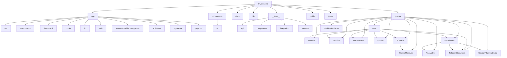

# Project Structure Analysis

## Database Schema Analysis

### Main Entities
1. User: Central entity for user management with role-based access control.
2. Invoice: Represents invoices in the system.
3. POWRA (Permit to Work Risk Assessment): Manages risk assessments.
4. FPLMission: Represents FPL (Flight Plan?) missions.
5. TailboardDocument: Documents related to FPL missions.

### Authentication and Session Management
- Account: Stores OAuth account information.
- Session: Manages user sessions.
- VerificationToken: Used for email verification.
- Authenticator: Stores authentication credentials.

### Relationships and Features
- Users can have multiple invoices, POWRAs, and FPL missions.
- POWRA includes ControlMeasures for risk management.
- FPLMission is associated with RiskMatrix and MissionPlanningScript.
- TailboardDocument has a workflow with creation, approval, and rejection processes.

### Enums and Statuses
- Role: USER, SUPERVISOR, ADMIN
- DocumentStatus: DRAFT, PENDING, APPROVED
- InvoiceStatus: PAID, PENDING
- POWRAStatus: DRAFT, SUBMITTED, APPROVED
- Risk: L, M, H

### Observations
1. The schema aligns well with the application structure we've observed, particularly with FPL missions, invoices, and POWRA features.
2. There's a strong focus on user roles and document statuses, indicating a workflow-based system.
3. The schema includes features for authentication, including OAuth and possibly WebAuthn (Authenticator model).
4. The TailboardDocument model has a complex approval process, suggesting a multi-step workflow for these documents.

### Alignment with Documentation
- The database schema generally aligns with the documentation we reviewed earlier.
- The presence of FPLMission, RiskMatrix, and MissionPlanningScript models confirms the importance of the FPL Missions feature mentioned in the documentation.
- The POWRA model aligns with the powra-crud-operations.md documentation we noted earlier.

### Potential Areas for Review
1. Verify that the database-schema.md in the docs folder accurately reflects this Prisma schema.
2. Ensure that the FPL-Missions-Features-Plan.md aligns with the features represented in the FPLMission, RiskMatrix, and MissionPlanningScript models.
3. Check if the user management process described in user-management-process.md matches the User model structure and relationships.
4. Review the auth-process-with-rbac.md to ensure it covers the role-based access control implemented in the User model.

### TODO: Further Analysis
- [x] Examine component usage in app/components
- [x] Investigate API routes in app/api
- [x] Check utility functions in app/utils
- [x] Verify test coverage in __tests__/api/fpl-missions.test.ts
- [x] Review documentation relevance in docs
- [x] Analyze database schema in prisma/schema.prisma

### Next Steps
1. Cross-reference the database schema with the API routes to ensure all necessary endpoints are implemented for each model.
2. Review the components to verify that they adequately cover the functionality represented in the database schema.
3. Check the test coverage to ensure all critical database operations are properly tested.
4. Update any outdated documentation to reflect the current database schema and application structure.
